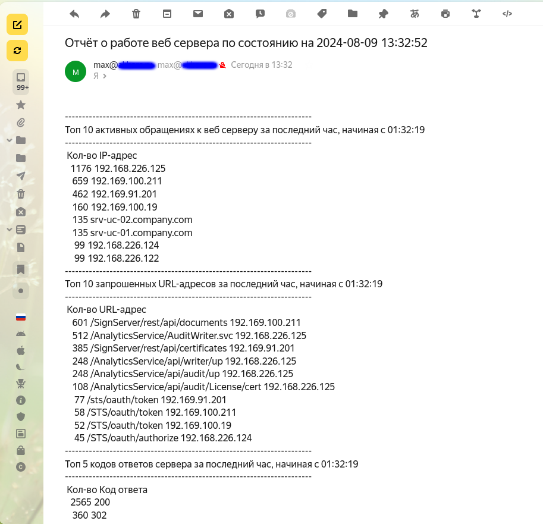

### Bash
Bash (Bourne-again Shell) — командная оболочка/язык программирования проекта GNU. Название представляет собой отсылку к предшественнику, существовавшей некогда командной оболочке Борна (Bourne shell). 
Bash работает в большинстве UNIX-подобных операционных систем, в том числе и в GNU/Linux. 

[Источник](https://wiki.archlinux.org/title/Bash_(%D0%A0%D1%83%D1%81%D1%81%D0%BA%D0%B8%D0%B9))

#### Типы переменных
  - *Локальные переменные* - определены в текущей сессии;
  - *Пользовательские переменные* - определены для конкретного пользователя, загружаются при входе в систему;
  - *Системные переменные* - определены во всей системе, доступны всем пользователям.

#### Конфигурационные файлы
  - **~/.bashrc** - В bash существует 3 различных типа оболочек: оболочка входа в систему - *login shell*, обычная оболочка - *normal shell* и интерактивная оболочка - *interactive shell*. 
Оболочки входа в систему читают **~/.profile**, а интерактивные оболочки читают **~/.bashrc**; в нашей настройке **/etc/profile** является источником для  **~/.bashrc** - таким образом, все настройки, сделанные здесь, также вступят в силу в оболочке входа.

  - **~/.bash_profile (.profile)** - Этот файл читается каждый раз при запуске оболочки входа в систему. Все остальные интерактивные оболочки будут читать только .bashrc; это особенно важно для языковых настроек, см. ниже.
> [!IMPORTANT]
> Большинство приложений поддерживают несколько языков вывода. Чтобы воспользоваться этой функцией, просто раскомментируйте одну из строк ниже или добавьте свой собственный (дополнительные коды см. в /usr/share/locale/locale.alias).
> Это перезапишет системный набор по умолчанию в /etc/sysconfig/language. в переменной RC_LANG.
```
#export LANG=de_DE.UTF-8        # uncomment this line for German output
#export LANG=fr_FR.UTF-8        # uncomment this line for French output
#export LANG=es_ES.UTF-8        # uncomment this line for Spanish output
```

  - **/etc/environment** - Определяет переменные окружения на системном уровне.

  - **/etc/bashrc** - Системный *bashrc* для локальных пользователей.

  - **/etc/profile** - Системный *profile* - переменные доступны для пользователей при удалённых сеансах входов.
#### Переменные
Примеры зарезервированных переменных:
  - *$@* - Параметры скрипта, вывод в столбик;
  - *$** - Параметры скрипта - строчный вывод;
  - *$0* - Имя скрипта;
  - *$1,$2,$3,...,* - Параметры скрипта по порядку; 
  - *$#* - Количество параметров;
  - *$?* - Статус выхода последней выполненной команды; 
  - *$$* - PID оболочки;
  - *$!* - PID последней, выполненной в фоновом режиме, команды.

Объявление переменных.
```
foo="Hello!"
echo $foo
Hello!
export foo
export -p | grep foo
declare -x foo="Hello!"
```

Удаление переменных:
```
env -i
```

Запуск оболочки без переменных
```
env -i bash
```

`unset var_nanme ` - Удалит переменную окружения (в.т. системную) в текущей сессии до её окончания.

#### Специальные символы
  - `^` - Начало строки;
  - `$` - конец строки;
  - `.` - любой символ;
  - `\` - экрнирование символа;
  - `[A-Z]` - диапазоны перечисления;
  - `[xyz]` - любой из символов;
  - `[^xyz]` - исключаемые символы;
  - `*` - любое кол-во символов.

#### Bash скрипты

> [!NOTE]
> **Shebang** - указывет интерпретатор скрипта и выглядит так: `#!/bin/bash` или `#!/bin/sh` или, например, так: `#!/usr/bin/python`. 

> [!TIP]
> Найти исполняемый файла *bash* можно с помощью команды `whereis bash`.
Пример:
```
whereis bash
bash: /usr/bin/bash /bin/bash /usr/share/bash /usr/share/man/man1/bash.1.gz /usr/share/info/bash.info.gz
```
> [!TIP]
> Для отладки скрипта можно вызвать его с помощью команды `bash -x script.sh` или заранее прописать в *shebang* следующим образом: `#!/bin/bash -x`.

##### Задание переменной, как результат вывода команды
Для этого можно использовать *грависы* (обратные кавычки), заключив в них команду при определении переменной, или используя конструкцию *variable=$(command)*, например: `mydir=$(pwd)`.

##### Математические операции
Пример:
```
var1=$(( 5 + 5 ))
echo $var1
10
var2=$(( $var1 * 2 ))
echo $var2
20
```
См. также [Команда let](https://linuxcookbook.ru/articles/komanda-let)

##### Сравнение строк
  - `str1 = str2` - Истина, если строки идентичны;
  - `str1 != str2` - Истина, если строки различаются;
  - `str1 < str2` - Истина, если str1 меньше, чем str2;
  - `str1 > str2` - Истина, если str1 больше, чем str2.
  - `-n str1` - истина, если длина str1 ненулевая;
  - `-z str1` - Истина, если длина str1 равна нулю.

##### Работа с файлами и каталогами
  - `-d file` - Истина, если файл существует и это директория; 
  - `-f file` - истина, если файл существует и это файл;
  - `-e file` - истина, если файл существует;
  - `-r file` - истина, если файл доступен для чтения;
  - `-w file` - истина, если файл доступен для записи;
  - `-s file` - истина, если файл пустой;
  - `-x file` - истина, если файл исполняемый;
  - `file1 -nt file2` - истина, если file1 новее file2;
  - `file1 -ot file2` - истина, если file1 старее file2;
  - `-O file1` - истина, если файл существует и текущий пользователь является владельцем
  - `-G file1` - истина, если файл существует и его идентификатор группы равен идентификатору группы текущего пользователя.
##### Вывод текстовой информации из файла на экран - cat, tac
Ключи:
  - `-b` - Пронумеровать непустые строки;
  - `-n` - пронумеровать все строки;
  - `-s` - объединить несколько идущих подряд пустых строк в одну;
  - `-T` - отобразить символы табуляции как "^|";
  - `-E` - отобразить символы конца строки как "$".

##### Вывод текстовой информации из файла на экран - head, tail
**Head** - вывод строк с начала файла.

Ключи:
  - `-n, --lines` - вывести заданное кол-во строк;
  - `-c, --bytes` - вывести заданное кол-во байт;
  - `-q, --quiet, --silent` - не выводить заголовки файлов.

**Tail** - вывод строк с конца файла.

Ключи:
  - `-n, --lines` - вывести заданное кол-во строк;
  - `-c, --bytes` - вывести заданное кол-во байт;
  - `-f, --follow` - выводить новые данные из файла по мере его увеличения.

##### wc - Подсчёт количества строк, слов и символов в тексте
Ключи:
  - `-l` - подсчёт кол-ва строк;
  - `-w` - подсчёт кол-ва слов;
  - `-c` - подсчёт кол-ва символов;
  - `-b` - подсчёт кол-ва байт.

##### paste - Объединение строк файлов
**Paste** объединяет вместе два разных файла в один многоколоночный файл.
 
Ключи:
  - `-d` - Изменение разделителя на заданный вместо [Tab] по умолчанию;
  - `-s` - Объединение строк в файле в одну строку.

##### tr - Замена или удаление символов
Использование - *tr [OPTION]... STRING1 [STRING2]*. tr заменяет одни символы на другие. Работает либо с символами, либо с классами символов - строчные, печатные, пробелы, буквенно-цифровые т.д.

Ключи:
  - `-d` - вместо замены удалить символы.

##### cut - Вырезает выбранные поля из каждой строки файла
Использование:
`cut −d delim -f list [file...]`
Где:
  - `-d` - Разделитель, по умолчанию используется <Tab>,
  - `-f` - Номер столбца.

##### Массивы - переменные с множеством значений
Примеры присвоения значений массиву:
```
array=('first element' 'second element' 'third element')
array=([3]='fourth element' [4]='fifth element')
array[0]='first element'
array[1]='second element'
```
Примеры обращения к элементам массива:
```
echo ${array[1]}
echo ${array[2]}
echo ${array[*]}
( IFS=$'\n' ; echo "${array[*]}" )
```
> [!IMPORTANT]
> IFS=$'\n' - разделитель элементов массива. По умолчанию в качестве разделителя используется пробел. 
> Чтобы установить в качестве разделителя  перенос каретки (окончание строки) задаётся значение этой переменной: IFS=$'\n'.

Ещё один пример обращения к элементам массива:
```
for item in ${array[*]}  
do
    printf "   %s\n" $item 
done
```
#### Практическая часть. Bash-скрипт для анализа журналов веб сервера
Задача написать скрипт для CRON, который раз в час будет формировать письмо и отправлять на заданную почту.

Необходимая информация в письме:
  -  Список IP адресов (с наибольшим кол-вом запросов) с указанием кол-ва запросов c момента последнего запуска скрипта;
  -  Список запрашиваемых URL (с наибольшим кол-вом запросов) с указанием кол-ва запросов c момента последнего запуска скрипта;
  -  Ошибки веб-сервера/приложения c момента последнего запуска;
  -  Список всех кодов HTTP ответа с указанием их кол-ва с момента последнего запуска скрипта.
  -  Скрипт должен предотвращать одновременный запуск нескольких копий, до его завершения.
  -  В письме должен быть прописан обрабатываемый временной диапазон.

Для работы скрипта будем использовать файл журнала *Microsoft IIS* с реального веб сервера, на которм работают пулы приложений программного обеспечения *КриптоПро DSS*. Перед тем, как использовать
данный журнал в практической работе, в нем были изменены все IP-адреса на вымышленные, а также изменены адреса электронной почты, записанные в журнал. Дополнительно, для корректной работы в ОС Linux,
переводы строк в журнале изменены на **UNIX**.

Типичный журнал IIS содержит следующие колонки:
```
#Fields: date time s-ip cs-method cs-uri-stem cs-uri-query s-port cs-username c-ip cs(User-Agent) cs(Referer) sc-status sc-substatus sc-win32-status sc-bytes cs-bytes time-taken
```
Где:
  - **date** - дата запроса;
  - **time** - время запроса;
  - **s-ip** - запрашиваемый ip-адрес (ip-адрес сервера);
  - **cs-method** - действие, которое пытался выполнить клиент (например, метод GET);
  - **cs-uri-stem** - ресурс, к которому получен доступ; например, default.htm;
  - **cs-uri-query** - запрос, если таковой имеется, который клиент пытался выполнить;
  - **s-port** - запрашиваемый порт;
  - **cs-username** - имя аутентифицированного пользователя. Для анонимных пользователей используется дефис (-);
  - **c-ip** - ip-адрес источника запроса;
  - **cs(User-Agent)** - браузер, используемый на клиенте$
  - **cs(Referer)** - предыдущий сайт, посещённый пользователем. Этот сайт предоставил ссылку на текущий сайт;
  - **sc-status** - статус действия в терминах HTTP или FTP;
  - **sc-substatus** - подстатус действия;
  - **sc-win32-status** - статус действия в терминах, используемых Microsoft Windows®;
  - **sc-bytes** - отправленные веб серверу байты;
  - **cs-bytes** - полученные от веб сервера байты;
  - **time-taken** - время обработки запроса.

[Источник](https://www.loganalyzer.net/log-analyzer/w3c-extended.html)

Нас интересуют поля **c-ip**, **cs-uri-stem** и **sc-status**.

Пример [скрипта](mgetlog.sh), который выполняет нужные нам запросы и отправляет полученную выборку на указанную почту ниже:
```
#!/bin/bash
vdate=$(date +"%H:%M:%S" -d "-1 hour")
vtime=$(grep '192.' u_ex240805.log | awk '{print $2}')
brd='------------------------------------------------------------------------'
IFS=$'\n'
for i in $vtime 
  do  
    if [[ "$i" < "$vdate" ]]
      then
        array+=( $(cat u_exl240805.log | grep "$i") )
    fi
  done
smail=$(
echo "$brd";
echo "Топ 10 активных обращениях к веб серверу за последний час, начиная с $vdate";
echo "$brd";
echo ' Кол-во IP-адрес';
echo "${array[*]}" | grep -v "::1" | awk '{print $9}' | sort -g | uniq -c -d | sort -gr | head -n 10;
echo "$brd";
echo "Топ 10 запрошенных URL-адресов за последний час, начиная с $vdate" ;
echo "$brd";
echo ' Кол-во URL-адрес';
echo "${array[*]}" | grep -v "::1" | awk '{print $5,$9}' | sort -g | uniq -c -d | sort -gr | head -n 10;
echo "$brd";
echo "Топ 5 кодов ответов сервера за последний час, начиная с $vdate";
echo "$brd";
echo ' Кол-во Код ответа';
echo "${array[*]}" | grep -v "::1" | awk '{print $12}' | sort -g | uniq -c -d | sort -gr | head -n 5;
echo "$brd";
)
echo "$smail" | mail -r max@company.ru -s "Отчёт о работе веб сервера по состоянию на $(date +"%F %H:%M:%S")" username@yandex.ru
exit 0

```
Здесь мы задали время, начиная с которого и до конца журнала будут выбираться записи, и передали его значение переменной *vdate*. В данном случае мы отняли от текущего значения даты 1 час:
```
vdate=$(date +"%H:%M:%S" -d "-1 hour")
```
Следующим шагом присвоили переменной *vtime* записи журнала, соответствующие заданному интервалу и содержащие колонку **time**:
```
vtime=$(grep '192.' u_ex240805.log | awk '{print $2}')
```
Для переменной *IFS* задали значение **$'\n'** - символ перевода каретки. Это понадобится при выборке элементов массива.

Далее извлекаем из журнала веб сервера все записи за указанный период и добавляем их в массив **array**:
```
for i in $vtime 
  do  
    if [[ "$i" < "$vdate" ]]
      then
        array+=( $(cat u_exl240805.log | grep "$i") )
    fi
  done
```
После этого выполняем выборки из массива с интересующими нас данными и передаём их переменной **smail**:
```
smail=$(
echo "$brd";
echo "Топ 10 активных обращениях к веб серверу за последний час, начиная с $vdate";
echo "$brd";
echo ' Кол-во IP-адрес';
echo "${array[*]}" | grep -v "::1" | awk '{print $9}' | sort -g | uniq -c -d | sort -gr | head -n 10;
echo "$brd";
echo "Топ 10 запрошенных URL-адресов за последний час, начиная с $vdate" ;
echo "$brd";
echo ' Кол-во URL-адрес'; 
echo "${array[*]}" | grep -v "::1" | awk '{print $5,$9}' | sort -g | uniq -c -d | sort -gr | head -n 10;
echo "$brd";
echo "Топ 5 кодов ответов сервера за последний час, начиная с $vdate";
echo "$brd";
echo ' Кол-во Код ответа';
echo "${array[*]}" | grep -v "::1" | awk '{print $12}' | sort -g | uniq -c -d | sort -gr | head -n 5;
echo "$brd";
)
```
В данном случае для структуризации выбираемых строк и ограничения вывода используются утилиты **awk**, **sort**, **uniq** и **head**. Так здесь:
```
echo "${array[*]}" | grep -v "::1" | awk '{print $9}' | sort -g | uniq -c -d | sort -gr | head -n 10;
```
  - мы отфильтровали (удалили) записи для *localhost* в *IPv6* адресации `grep -v "::1"`, перенправили вывод в **awk**, 
которая выбрала колонку с номером 9 (ip-адрес клиента);
  - далее, строка была перенаправлена на вход утилите **sort**, для группировки ip адресов; 
  - следующая утилита **uniq** с ключами *-c* и *-d* удалила дубли записей и добавила счетчик вхождений для каждой повторяющейся строки; 
  - полученный результат снова был отправлен на вход утилиты sort, которая произвела сортировку записей в обратном порядке (ключ **-r**); 
  - следующим шагом мы ограничили вывод десятью записями с помощью перенаправления выборки утилите **head** с ключом **-n 10**.

Остальные фильтрующие запросы к журналу выполнены точно так же с отличием лишь в выбираемых колонках.

Результатом выполнения данного скрипта будет  с отчетом вида:
```
------------------------------------------------------------------------
Топ 10 активных обращениях к веб серверу за последний час, начиная с 01:32:19
------------------------------------------------------------------------
 Кол-во IP-адрес
   1176 192.168.226.125
    659 192.169.100.211
    462 192.169.91.201
    160 192.169.100.19
    135 srv-uc-02.company.com
    135 srv-uc-01.company.com
     99 192.168.226.124
     99 192.168.226.122
------------------------------------------------------------------------
Топ 10 запрошенных URL-адресов за последний час, начиная с 01:32:19
------------------------------------------------------------------------
 Кол-во URL-адрес
    601 /SignServer/rest/api/documents 192.169.100.211
    512 /AnalyticsService/AuditWriter.svc 192.168.226.125
    385 /SignServer/rest/api/certificates 192.169.91.201
    248 /AnalyticsService/api/writer/up 192.168.226.125
    248 /AnalyticsService/api/audit/up 192.168.226.125
    108 /AnalyticsService/api/audit/License/cert 192.168.226.125
     77 /sts/oauth/token 192.169.91.201
     58 /STS/oauth/token 192.169.100.211
     52 /STS/oauth/token 192.169.100.19
     45 /STS/oauth/authorize 192.168.226.124
------------------------------------------------------------------------
Топ 5 кодов ответов сервера за последний час, начиная с 01:32:19
------------------------------------------------------------------------
 Кол-во Код ответа
   2565 200
    360 302
------------------------------------------------------------------------
```
Спасибо за прочтение! :potted_plant:
